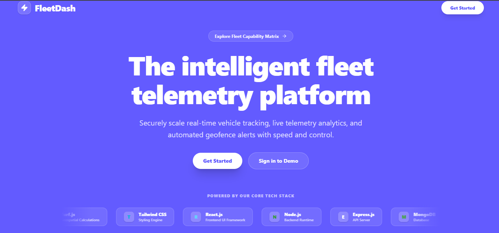
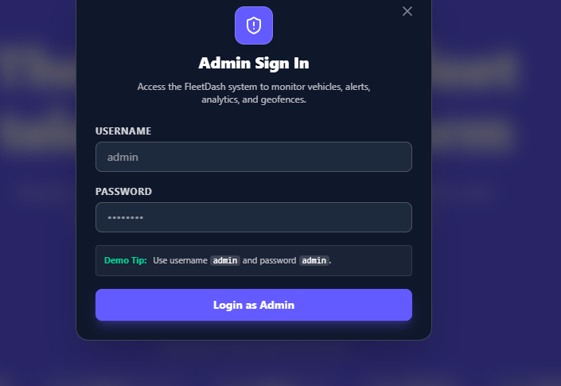
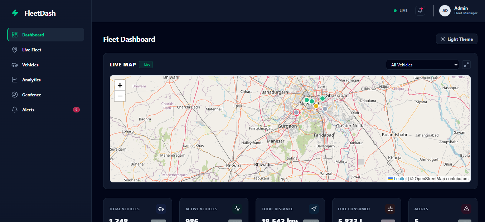
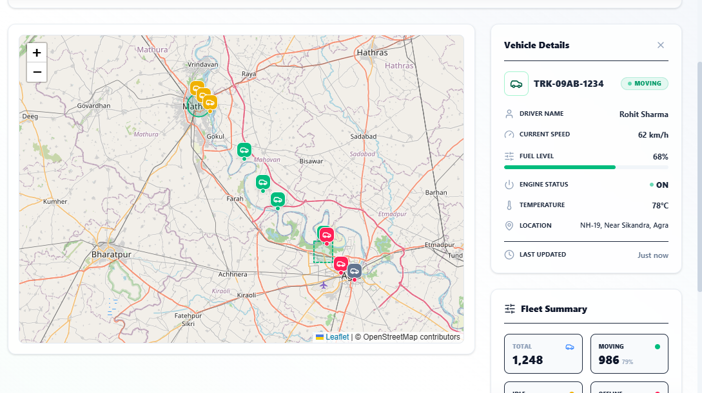

                                                  FleetDash

### Smart Fleet Management & Telemetry Dashboard

FleetDash is a modern **MERN Stack** application built to simplify fleet operations through an intuitive dashboard. It enables administrators to monitor vehicles, manage geofences, visualize analytics, and track telemetry data from a centralized platform.

🌐 **Live Fleet Tracking** • 📍 **Geofence Management** • 📊 **Analytics** • 🚚 **Vehicle Management** • 🔐 **JWT Authentication**

---

## 📸 Preview 


### 🚀 Landing Page

> A modern landing page introducing the FleetDash platform.



---

### 🔐 Admin Authentication

> Secure administrator login with JWT-based authentication.



---

### 📊 Fleet Dashboard

> Interactive dashboard displaying fleet statistics, live map, and operational insights.



---

### 📍 Live Fleet Tracking

> Monitor vehicle locations on an interactive map with real-time-ready architecture.



---

### 🗺️ Geofence Management

> Create and manage virtual boundaries while monitoring vehicle activity inside geofences.


---

# ✨ Features

### 🔐 Authentication

- Secure Admin Login
- JWT Authentication
- Protected Routes
- Password Encryption using bcrypt

### 🚚 Fleet Management

- Add, Update & Delete Vehicles
- Vehicle Status Monitoring
- Driver Information Management
- Fleet Overview Dashboard

### 📍 Live Fleet Tracking

- Interactive Leaflet Maps
- Vehicle Location Visualization
- Vehicle Information Panel
- Status Indicators
- Real-Time Ready Architecture

### 🗺️ Geofence Management

- Create Geofences
- Update Geofence Details
- Delete Geofences
- Zone Monitoring
- Vehicle Boundary Management

### 🚨 Alert Management

- Generate Alerts
- Resolve Alerts
- Delete Alerts
- Fleet Notification System

### 📊 Dashboard & Analytics

- Fleet Statistics
- Vehicle Summary
- Active Vehicles
- Distance Covered
- Fuel Consumption
- Alert Summary

### 🎨 User Experience

- Modern Responsive UI
- Dark & Light Theme
- Interactive Dashboard
- Clean Navigation
- Reusable Components

---

# 🛠 Tech Stack

### Frontend

| Technology | Purpose |
|------------|---------|
| React.js | User Interface |
| Vite | Build Tool |
| Tailwind CSS | Styling |
| React Router | Routing |
| Axios | API Communication |
| Leaflet | Interactive Maps |
| Recharts | Charts & Analytics |
| Lucide React | Icons |

---

### Backend

| Technology | Purpose |
|------------|---------|
| Node.js | Runtime |
| Express.js | REST APIs |
| MongoDB | Database |
| Mongoose | ODM |
| JWT | Authentication |
| bcryptjs | Password Encryption |
| Cookie Parser | Cookie Management |
| CORS | Cross-Origin Requests |

---

# 📂 Folder Structure

```text
FleetDash
│
├── frontend
│   ├── src
│   │   ├── assets
│   │   ├── components
│   │   ├── pages
│   │   ├── hooks
│   │   ├── utils
│   │   └── App.jsx
│   └── package.json
│
├── backend
│   ├── src
│   │   ├── config
│   │   ├── controllers
│   │   ├── middleware
│   │   ├── models
│   │   ├── routes
│   │   ├── utils
│   │   └── server.js
│   └── package.json
│
└── README.md
```

---


# 📈 Development Journey

### Week 1 – Frontend Development

- Designed a responsive landing page and admin dashboard.
- Built reusable React components for a modular UI.
- Developed Dashboard, Live Fleet, Analytics, Alerts, and Geofence pages.
- Integrated interactive Leaflet maps for vehicle visualization.
- Implemented dark and light themes.
- Focused on creating a clean, responsive, and user-friendly interface.

### Week 2 – Backend Development

- Set up the Node.js and Express backend architecture.
- Connected the application with MongoDB using Mongoose.
- Implemented JWT-based authentication and protected routes.
- Developed REST APIs for Vehicles, Geofences, Alerts, Dashboard, and Telemetry.
- Tested APIs using Thunder Client.
- Prepared the backend for frontend integration and future real-time capabilities.

---

# ⚙️ System Architecture

```text
                    Admin
                      │
                      ▼
              JWT Authentication
                      │
                      ▼
              Fleet Dashboard
     ┌─────────┼──────────┬─────────┐
     ▼         ▼          ▼         ▼
 Vehicles   Live Map   Geofence   Analytics
     │         │          │
     └─────────┼──────────┘
               ▼
          REST APIs
               │
               ▼
      Node.js + Express Server
               │
               ▼
            MongoDB
```

---

# 🔄 Application Workflow

```text
Admin Login
      │
      ▼
JWT Authentication
      │
      ▼
Dashboard
      │
      ├──────────► Vehicles
      │
      ├──────────► Live Fleet
      │
      ├──────────► Geofence
      │
      ├──────────► Alerts
      │
      └──────────► Analytics
                    │
                    ▼
               MongoDB Database
```

---

# 🚀 Installation

### Clone the Repository

```bash
git clone https://github.com/your-username/FleetDash.git
```

### Frontend Setup

```bash
cd frontend
npm install
npm run dev
```

### Backend Setup

```bash
cd backend
npm install
npm run dev
```

---

# 🔑 Environment Variables

Create a `.env` file inside the backend folder.

```env
PORT=5001

MONGO_URI=your_mongodb_connection_string

JWT_SECRET=your_secret_key

NODE_ENV=development
```

---

# 📡 API Modules

### Authentication

- Login
- Signup
- Logout
- Check Authentication

### Dashboard

- Fleet Statistics
- Dashboard Overview

### Vehicles

- Create Vehicle
- Update Vehicle
- Delete Vehicle
- Get Vehicles

### Geofence

- Create Geofence
- Update Geofence
- Delete Geofence
- View Geofences

### Alerts

- Create Alerts
- Resolve Alerts
- Delete Alerts
- Clear Resolved Alerts

### Telemetry

- Store Telemetry Data
- Fetch Vehicle Telemetry

---


# 🔮 Future Improvements

- 🔄 Real-Time Vehicle Tracking using Socket.IO
- 📍 Automatic Geofence Detection
- 📊 Advanced Fleet Analytics
- 📱 Mobile Responsive Enhancements
- 🔔 Push Notifications
- 📈 Performance Optimization
- 🐳 Docker Deployment
- ☁️ Cloud Deployment
- ⚡ Redis Integration

---

# 👨‍💻 Author

**Vansh Saxena**

B.Tech CSE • MERN Stack Developer

---


</div>
